# MIT-CG6.837-2004 

### reviewing 正在重写中。

课程网站 

6.837 Intro to Computer Graphics, Fall 2004

http://groups.csail.mit.edu/graphics/classes/6.837/F04/index.html 

环境配置：

- Win10 + Clion + Freeglut
- src 文件夹包括课程提供的、自己写的.h .cpp
- include 文件夹包括 freeglut 头文件
- lib 文件夹包括 freeglutd.lib，由 cmake 和 vs 生成
- out 文件夹包括.exe .txt .tga 和 freeglutd.dll
- README_PICTURES 包含本文的图片


### 0. Iterated Function Systems

产生 num 个随机点，经过 iters 次矩阵（随机选取）变换，保存到图片中对应位置。 

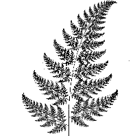


### 1. Ray Casting

这里使用 Algebraic 和 Geometric 计算交点。

**注意点1：**

不要 delete 同一片内存两次，不需要在 ~Object3D() 中 delete material; 因为 material 申请内存的操作不在这个类中，由其他类负责。

```
class Object3D {
//virtual ~Object3D() {delete material;}  error
virtual ~Object3D() {}  //right

Material *material;
};
//因为scene_parser.C中 ~SceneParser已经 delete materials[i]
//这个错误在clion中只会返回异常: 0xC0000005，而在vs中会指向错误的地方，当clion中返回值!=0时，又找不到出错的地方，可以在vs中找。
```

**注意点2：**

image 对应于 （0, 200）and 比例（0, 1）

OrthographicCamera 的 center 在（0, 0），因此产生的光线对应于 （-1, 1）* size

**注意点3：**

error: multiple definition of 函数多次定义

解决办法一：把函数定义写到 .cpp；

解决办法二：在 .h文件中，把定义与声明写在一起，即把函数定义写在类内。

**注意点4：**

在使用 Geometric 法计算交点时，为了得到与样例相符的图片，忽略 t 是否在视线后面，即 camera center 是否在球体内部，永远取 t = min(t1, t2)


### 2. Transformations

**注意点1：**

三角形计算交点可以使用 Matrix.cpp 中的 det3x3

**注意点2：**

把 rd 从 world-space 转换到 object-space 的时候不要 normalize()

**注意点3：**

scene_16

注意 object-space 中 t 代表的是长度还是比例，注意 rd_len != 1 引起的问题。

球体的 Algebraic 算法中，定义 a = rd.Dot3(rd) 即可解决。

球体的 Geometric 算法中，因为 tt = sqrt(radius * radius - d2) 是长度，所以令 tp = -ro.Dot3(rd) / (rd_len) 也为长度，计算出 t，再令 t = t / rd_len，转换为比例，进行后续步骤。 

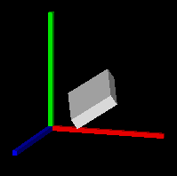

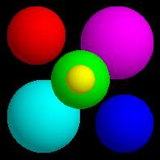


### 3. Phong_Shaing

**注意点1：**

补充了 OpenGL 的内容。

**注意点2：**

Phong 与 BlinnPhong 的区别在于，前者在 v, l 同向时且 exponent 较小的时候，会产生明显的断层现象。

注意点3：

OpenGL 画球体中，phi_steps 作为纬度的步长，取到首尾， theta_steps 作为经度的步长，取首不取尾。把球体定义为 quad，比 定义为 triangle 简单。

**注意点3：**

Flat shading (visible facets)  使用 quad 的 normal，quad 是一个平面，因此产生可见面。

Gouraud interpolation 使用顶点 vertex 的 normal，效果比 Flat shading 好。

Phong interpolation 把 vertex.normal 在光栅化中插值为 pixel.normal，精度最高，这是 pipeline 中的做法。

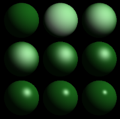


### 4. Shadows, Reflection & Refraction

**注意点1：**

正交相机判断阴影的方法，直接设 float tmin = 0.0001f; 而不是 getTmin() + 0.0001f;

**注意点2：**

要多使用 OpenGL previsualization，能够找出大部分关于反射和折射的问题，在 scene4_07 8 9 涉及球体的内部反射折射问题，只能使用 Algebraic 算法来求交点，Geometric 法求交会减少射线的产生，发生错误。

**注意点3：**

```c++
RayTracer::traceRay(Ray &ray, float tmin, int bounces, float weight, Hit &hit);
```

省略了相机所处的 indexOfRefraction，默认为空气，即 1.0；

把 hit 作为参数，是为了在画 RayTree 中的反射和折射线，不然缺少交点参数。

这里 weight 没有使用到，因为 max_bounces  <= 5，而 Raytrace in one weekend 资料中符合物理的光线追踪，max_bounces 取 50次。

**注意点4：**

不在 RayTracer 中单独设置 mirrorDirection 和 transmittedDirection 这两个函数，参考 Raytrace in one weekend 中的结构，把 shading， reflect，refract 所需的操作都定义到 Material 类中，感觉代码会简洁，易扩展。

```c++
Vec3f PhongMaterial::Shade(const Ray &ray, const Hit &hit, const Vec3f &l, const Vec3f &lightColor) const;
bool PhongMaterial::reflect(const Ray &ray, const Hit &hit, Vec3f &attenuation, Ray &reflected) const;
bool PhongMaterial::refract(const Ray &ray, const Hit &hit, Vec3f &attenuation, Ray &refracted) const;
```

！！！尤其注意的一点是 Shade 这个函数中，必须判断 normal 与 rd 的方向关系，由于前面的内容没有涉及内部着色，这个问题会在 gem.txt 的测试中暴露出来，由于这个问题在 OpenGL previsualization 中也不会显示，因此找了好久好久好久好久好久。

```c++
if(normal.Dot3(rd) > 0)    normal = -1 * normal;
```

**注意点5：**

tmin 这个数据其实可以设置在 hit 类中，但由于延续课程的风格，就放在函数参数中了。

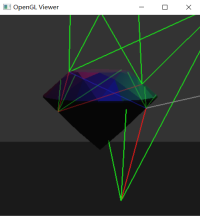

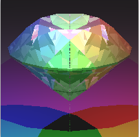


### 5. Voxel Rendering

**注意点1：**

修正 Material::Shade 函数，需要在构造函数中初始化 int 类型的变量，不然会产生错误，添加 shade_back 全局变量来决定背面渲染，在上一个 assignment 中被省略了。

**注意点2：**

为了正确渲染，需要把 glCanvas.cpp 中的 glLightModeli(GL_LIGHT_MODEL_TWO_SIDE, GL_TRUE); 注释掉

**注意点3：**

```c++
void Grid::initializeRayMarch(MarchingInfo &mi, const Ray &r, float tmin) const;
//视点在外面，相交或不相交，取与每个轴相交的三个近点的最大值；
//视点在里面，因为与每个轴相交的近点都小于 tmin，需要利用 dt 步进来取到刚好大于 tmin 的三个交点的非 -INF 最小值。
//设置 i,j,k 时，注意 mi.i == nx 的情况，需要 mi.i--；
void MarchingInfo::nextCell();
//注意更新 mi.normal；
```

**注意点4：**

 previsualization 1 简单，直接画六个面比较方便，与 cell 相交的基元的个数决定了 cell 的颜色。

 previsualization 2 写在 Grid::intersect 中，在 traceRayFunction 中调用，使用随机着色。

previsualization 3 省略。

**注意点:5：**

三角形的网格化是对它的 boundingbox 进行网格化，当三角形平行坐标轴，且计算的 start_i == nx 时，需要 start_i--，这在 scene11的 transform 中出现。

**注意点6：**

```c++
virtual bool is_triangle(); //use a special case for triangles 
virtual BoundingBox *getTriangleBoundingBox(const Matrix &m) const;
//定义两个函数来获取紧凑的三角形包围盒，但是感觉这样代码结构不是很干净。
```

**注意点7：**

scene12 中， 当球体被变换时，使用 Object3D::insertIntoGrid，当球体无变换时，使用 cell 跟 center 比较的方法，由于这个父类函数只被球体调用了，所以全部写在球体方法里也可以；

三角形使用 Object3D::insertIntoGrid 方法时，产生松散的包围盒，使用自己单独定义 Triangle::insertIntoGrid 时，产生紧凑的包围盒。

Transform::insertIntoGrid 中进行矩阵相乘。

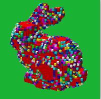

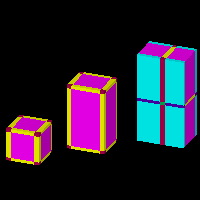


### 6. Grid Acceleration & Solid Textures

**注意点1：**

修改 Grid::initializeRayMarch，把  if (rd.x() < 0)  swap(t1_x, t2_x);  替换为 if (t1_x > t2_x) swap(t1_x, t2_x); 因为 rd.x() 可能为 +0 或 -0；

修改 ro inside 部分代码中写错的字母，把 y 写成了 x，若不使用 shadows 或 reflect，这个错误不会暴露。

**注意点2：**

插入 Grid::opaque 中的 Object3D* ，如果是 Transform，则需要把 g->opaque[index].push_back(this); 替换为 g->opaque[index].push_back(new Transform(*m, this));

**注意点3：**

为了避免一条 ray 遍历 cell 的过程中，多次与包含在多个 cell 中的同一个没有交点的 obj 相交，使用 std::set<Object3D *> 来标记，在 Grid::intersect 和 Grid::intersectShadowRay 中使用，渲染 scene6_04_bunny_mesh_200.txt 效果如下：

不使用 grid 结果：          

total intersections        21480230

使用 grid 但不使用 set：

total intersections        956838
total cells traversed      225285

使用 grid 且 使用 set：

total intersections        619458
total cells traversed      225285

我们看出，使用 grid 可以大大减少求交，减少了 20 倍，使用 set 可以再减少 1/3 的求交。

**注意点4：**

在 scene6_07_bunny_mesh_40k.txt 中，阴影会产生一丢丢不太一样的地方，三角形个数越多越明显，在bunny_mesh_200 1k 5k 的图片中看不太出来，有可能是 Grid::initializeRayMarch 中 ro inside 代码部分的问题，但是找不到。


**注意点5：**

纹理部分，除了棋盘格，其他都不太标准，matrix 用于把 hit.p 从世界空间转到物体空间。

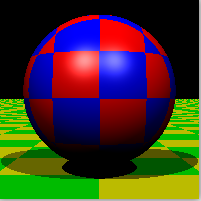

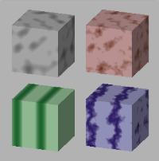

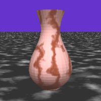


### 7. Supersampling and Antialiasing（未完成）


参考：

https://github.com/Birdy-C/MIT-6-837

https://github.com/Aesma/CG-Project3-3
